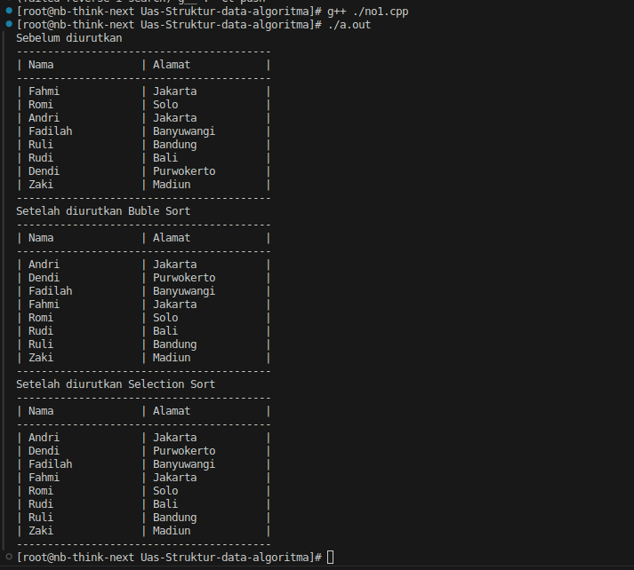
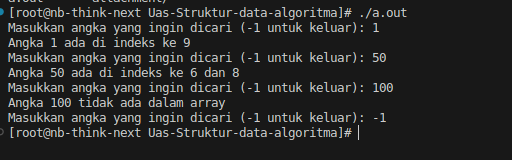

# UAS Struktur Data dan Algoritma

```
Nama  : I Gusti Ngurah Bagus Trisna Andika
Kelas : IT201
NIM   : 230401010136
```

## How to compile

Di linux gunakan `g++`

```sh
g++ ./no1.cpp
```

## Hasil test running

1. Program sorting array bublesort & selection sort



2. Program search index berdasarkan value dengan `binary serach`

